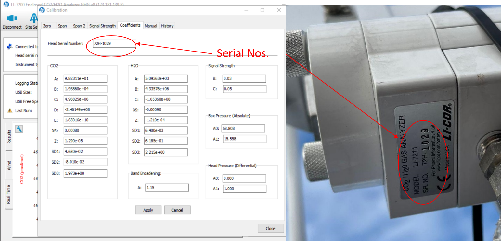
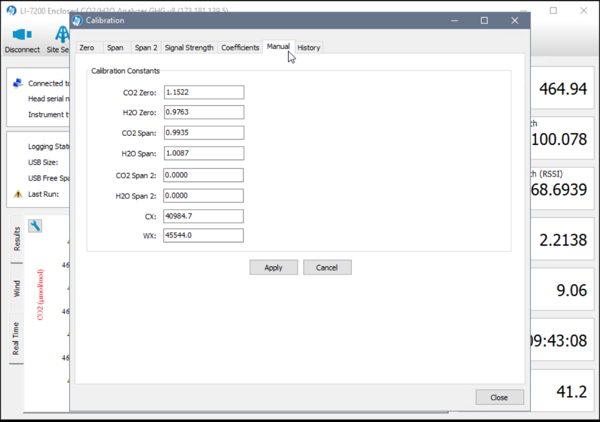

#  Calibration Procedures
{: .no_toc }

This page details the steps for calibrating the 7200 and 7700.  Always do the 7200 first, followed by the 7700.  You **must** clean the sensors before calibration. 

### **To Do**: Should we 'formally' require calibration on each site visit?
* Calibration should be performed any time you open the LI7200

* If you are not confident with the calibration procedures, you can review the LICRO docs for the [7200](https://www.licor.com/env/support/LI-7200RS/topics/calibration-procedure.html) and the [7700](https://www.licor.com/env/support/LI-7700/topics/calibration.html)

  

    Table of contents
  

  {: .text-delta }
1. TOC
{:toc}

---

# Getting Started

**1**{: .label .label-blue} Make sure the flow module, tubing, 7700 calibration shroud, and necessary wrenches are ready.
* **Note** At BB1 & BB2, it is in the equipment box, for DSM & RBM you must bring to the field.

# Calibrating the 7200

**1**{: .label .label-blue} On the laptop open the program ‘Li 7X00’ and connect to instrument.  Click the LI-7200 icon and choose ‘calibration’.

**2**{: .label .label-blue} Save the old calibration coefficients.  Click “Config Files” tab >>  “Save Configuration” >> check all and “continue”.
* Place the file in this directory “C:\InstrumentCalibrations\LI-7200\SNxxxx”.  The LI 7200 serial numbers are listed in the table below.
	* The naming template is:  yyyymmdd(**site visit date**)\_Configuration\_Before\_calibrations.l7x
* Screenshots should also be taken before and after calibrating and saved in the same directory.

<h2 align='center'>LI 7200 Serial Numbers</h2>

  Site | Value |
-------|-------| 
BB1    | 0816  |
BB2    | 0815  |
DMS    | 1029  |
RBM    | 	...  |

**3**{: .label .label-blue} Check the head serial number information in “LI-7200” > “Calibration” > “Coefficients”.  Make sure the head serial number on the sensor matches that in the software (see table above).

	

**4**{: .label .label-blue} Connect the calibration flow tube to the 7200 head.  At BB2, DSM & RMB - there is a special intake novel that is always connected to the intake tube? At BB1 you need to do manually disconnect the intake tube first? 

### **To Do**: Add pics for each site?

## Set CO2 zero

**5**{: .label .label-blue} Connect the flow meter to the N2 gas tank and open main valve **(on is left, off is right)**.
* **Note**: PSI should be ~ 1200 (not necessary to the procedure, but good to note as it will decrease over time and indicated when we need a new gas tank)

**6**{: .label .label-blue} Open regulator slowly until the flow rate is around 18-20 L/min.  You should hear the flow.  **Note: reversed directions (on is right, off is left)**

**7**{: .label .label-blue} Watch plot on the program: CO2 should drop to 0.  On the calibration screen – green flags show that CO2 concentrations are steady.  You may need to change the scale on the chart.  

* Click “Zero CO2” > “OK”
* Click “Zero H2O > “OK”
* Check graph values continuously throughout the process to make sure values are correct

**7**{: .label .label-blue} Close regulator then close the main N2 tank value and disconnect the flow meter.

## Set CO2 span

**8**{: .label .label-blue} Move flow meter to CO2 tank and open the main valve **(on is left, off is right)**.
* **Note**: PSI should be ~ 1200 (not necessary to the procedure, but good to note as it will decrease over time and indicated when we need a new gas tank)
### **To Do**: Confirm value?

**9**{: .label .label-blue} Open regulator slowly until the flow rate is around 18-20 L/min.  You should hear the flow.  **Note: reversed directions (on is right, off is left)**

**10**{: .label .label-blue} Enter CO2 concentration (ppm), Confirm the **exact** value on the tank.  Then Watch plot on the program: CO2 should increase until it stabilizes.  On the calibration screen – green flags show that CO2 concentrations are steady.  You may need to change the scale on the chart again.

* Click Span CO2” > “OK”
	* **Do Not** Click Span H2O

**10**{: .label .label-blue} Close regulator then close the main CO2 tank value and disconnect the flow meter.
* Check how much gas we have left & take a picture

## Check the Coefficients

**11**{: .label .label-blue} You can find the calibration results in “LI-7200” > “Calibration” > “Manual” tab. Reference the table below for acceptable values.  Take a screenshot (alt + print screen) of the manual tab and save it to the Micromet Google drive: Micromet Lab/Projects/(**Flux Site**)/Flux-tower/Calibrations/LI-7200/SNXXXX (reference serial number table above)

<h2 align='center'>Optimal Calibration Constant Values</h2>

Constant            |  Value       | Notes
--------------------|--------------|-----
CO2 Zero | 0.85 ~ 1.1   | Zero is primarily affected by temperature, and the state of the internal chemicals
CO2 Span | 0.97 ~ 1.03  | A value outside this range indicates is a warning sign for me that something is not correct with either the instrument (wrong head, bad sensor) or with the tank (not accurately calibrated).
H2) Zero | 0.9 ~ 1.2    | Set in lab (dobule check frequency?)
H2) Span | 0.9 ~ 1.1    | Set in lab (dobule check frequency?)

	

**12**{: .label .label-blue} Save the after calibration coefficients. Click “Config Files” tab >>  “Save Configuration” >> check all and “continue”.  Use same naming/saving convention as above.

**13**{: .label .label-blue} Disconnect calibration tubing from 7200 intake.  All the connections on the tubing that stays connected to the 'T' on the 7200 head should be wrench tight when finished with calibrations.

**14**{: .label .label-blue} Exit the program

# Calibrating the  7700

### **To Do**: Ask - should we save screenshots for 7700 calibrations?

**1**{: .label .label-green} Open the program ‘LI-7700’ and go to the data page 1 >> 1 chart CH4 (umol/mol).

**2**{: .label .label-green} Use calibration cylinder to cover the 7700.  Make sure to remove 7700 head cap and washer tube first then orient the tube with the straps on top and slide tube over the instrument.

**3**{: .label .label-green} Attach the small black tube into the LI-7700 cover and attach other end to the black tube with the flow meter (same one as used for 7200). Make sure to check union connections.

## Set CH4 zero

**4**{: .label .label-green} Connect the flow meter to the N2 gas tank and open main valve **(on is left, off is right)**.
* **Note**: PSI should be ~ 1200 (not necessary to the procedure, but good to note as it will decrease over time and indicated when we need a new gas tank)

**5**{: .label .label-green} Open regulator slowly until the flow rate is around 18-20 L/min.  You should hear the flow.  **Note: reversed directions (on is right, off is left)**

**5**{: .label .label-green} Watch plot on the program: CH4 should drop to 0 (or \~.13).  On the calibration screen – green flags show that it’s steady  Change scale if needed to check that the trace is flat/steady

* Click “Zero CH4” > “Apply”

**6**{: .label .label-green} Close regulator then close the main N2 tank value and disconnect the flow meter.
* Check how much gas we have left & take a picture

## Set CH4 span

**7**{: .label .label-green} Move flow meter to CH4 tank and open the main valve **(on is left, off is right)**.
* **Note**: PSI should be ~ 1200 (not necessary to the procedure, but good to note as it will decrease over time and indicated when we need a new gas tank)
### **To Do**: Confirm value?

**8**{: .label .label-green} Enter CH4 concentration (ppm), Confirm the **exact** value on the tank.  Then Watch plot on the program: CH4 should increase until it stabilizes.  On the calibration screen – green flags show that CH4 concentrations are steady.  You may need to change the scale on the chart again.
* Click “Span CH4” > “Apply”

**9**{: .label .label-green} Close regulator then close the main CH4 tank value and disconnect the flow meter.
* Check how much gas we have left & take a picture

**10**{: .label .label-green} Remove the calibration shield, make sure to disconnect the tubing first.  Then make sure to replace the 7700 head cap and washer tube first.

### To Do: Check the Coefficients
