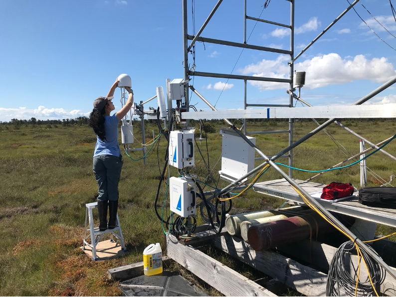
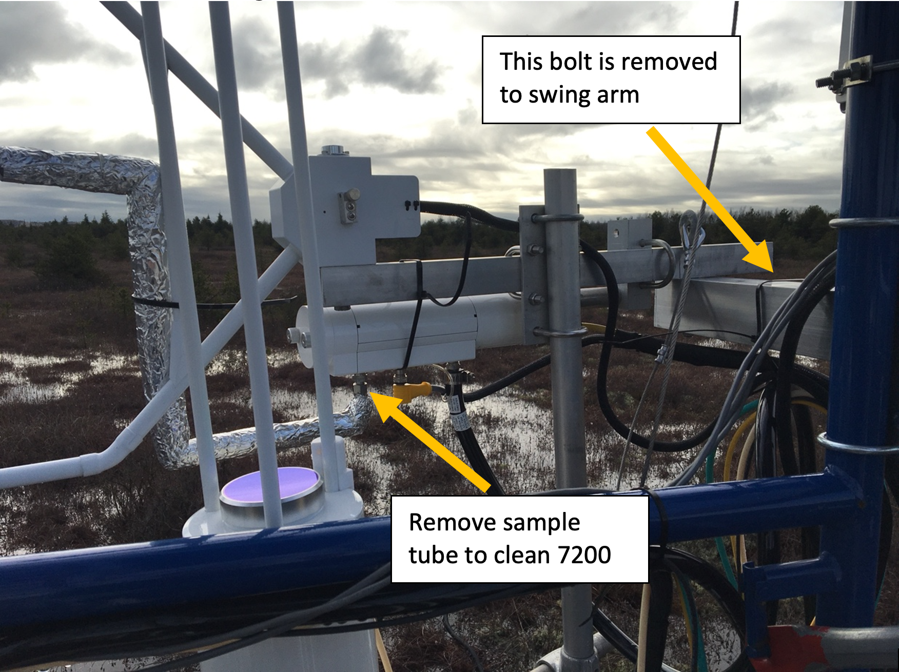
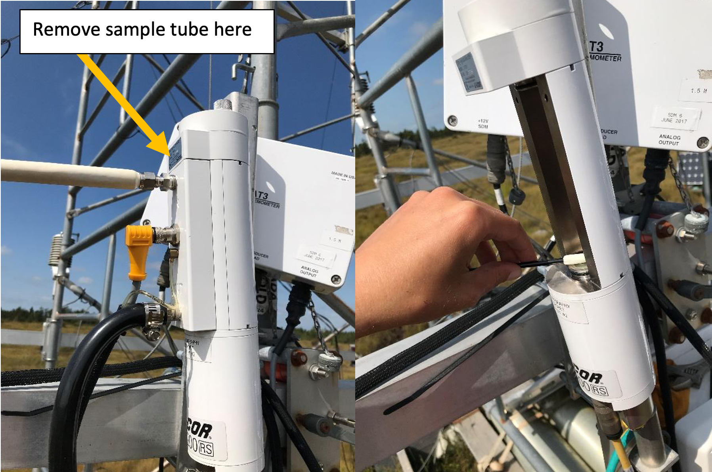

#  Cleaning Procedures
{: .no_toc }

This page details the steps for cleaning the 7700 and 7200.  Always do the 7700 first, followed by the 7200.  You **must** clean the sensors before calibration.

  

    Table of contents
  

  {: .text-delta }
1. TOC
{:toc}

---

# Getting Started

**1**{: .label .label-red} Connect the laptop to the site system using the ethernet cable and dongle to the top box on the outside of the scaffolding. **Note**: remote connection via vinimet & mobile hotspot can also work in a pinch.

### **To Do**: Add pics of logger box at each each site for reference.

 
**2**{: .label .label-red} Retract the boom to access the flux sensors.  Loosen the two bolts securing the boom > pull quick release tab> slide boom in > *Be mindful of cables*
* **For BB1 & DSM**: place stepladder on plywood on the ground.  Make sure it’s solid.  

	

* **For BB2 & RBM**: loosen the wing nut > remove the fastening boot > lift up sensors to reduce force needed to pull out the bolt > rotate the arm to bring the sensors within reach from platform.  *Be careful* this can be quite difficult.

	

**3**{: .label .label-red} Do a visual inspection of the sensors and note/address any obvious issues.

---

# Cleaning the LI 7700

**1**{: .label .label-blue} On the laptop, open the program ‘LI-7700’.  Click "Connect" >> Ethernet >> Select Instrument >> Connect.  Open 2nd data page and look at the single graph with signal strength

### **To Do**: Add  Screenshot
 

**2**{: .label .label-blue} Wipe top and bottom windows with windshield cleaner (wet then dry cloth) until signal strength is sufficient:

	

<h2 align='center'>Desired LI 7700 Signal Strength by Site</h2>

  Site | 	Value	    |
-------|------------| 
BB1    | 	High 50’s |
BB2    | 	Around 80 |
DMS    | 	Around 70 |
RBM    | 	...\      |

**3**{: .label .label-blue} Disconnect from the 7700 and close the LI-7700 program.

---

# Cleaning the LI 7200

**1**{: .label .label-green} Power down the flux system.  Inside the power box, flip the 3 switches as shown in the table below.  The power is off when the red light is on.

<h2 align='center'>EC Sensor Power Channels</h2>

  Site | 	LI-7200 flow module (pump)	| LI-7700	| LI-7550
-------|------------------------------|---------|--------   
BB1    | 	12                          |	    7	|   2
BB2    | 	3                           |	    4	|   5
DMS    | 	3                           |	    4	|   5
RBM    | 	TBD                         |	    TBD	|   TBD

**2**{: .label .label-green} Take the intake tube off by loosening the nut with a wrench.  The tube can then just hang loosely from the tower, disconnected from the 7200.  Then loosen the knobs on top of 7200 to release the top and take side part off to open the 7200 sensor head.  This can can hang next to the instrument while cleaning.

	

	

**3**{: .label .label-green} Wipe top and bottom windows with windshield cleaner (wet then dry cloth).  Then clean intake filter with a wipe.
* You may need to replace with a spare clean cap intake. If so: remove the foil wrap, loosen the metal ring with pliers and push it all the way to the tube, remove and replace the cap, use pliers to put the metal ring back on the cap

**4**{: .label .label-green} Power system back up using switches listed in the table above. **Note**: The start up sequence is: **1)** LI-7200 pump, **2)** LI-7700, **3)** LI-7550.  Allow 90 seconds between each sensor when powering up. This order is important for proper start up.  
* Inside the Li-7550 box, the USB logging light should be flashing

**5**{: .label .label-green} On the laptop open the LI 7x00 program and connect the the 7500 to check that the signal strength is sufficient:

<h2 align='center'>Desired LI 7200 Signal Strength by Site</h2>

  Site | 	Value	    |
-------|------------| 
BB1    | 	About 100 |
BB2    | 	About 103 |
DMS    | 	About 102 |
RBM    | 	...       |
