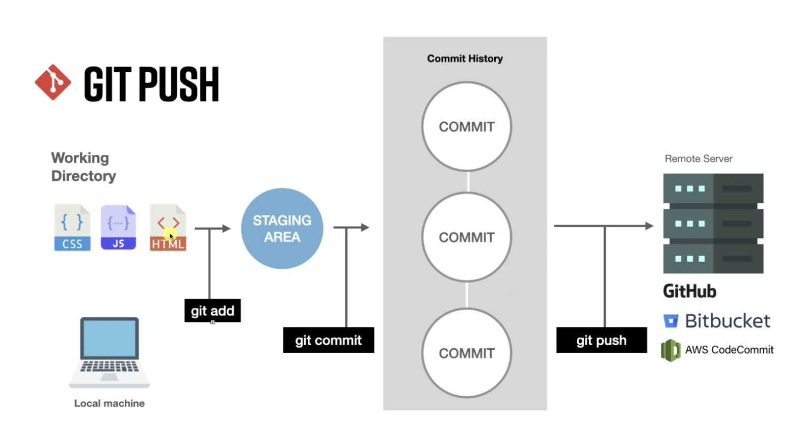

# Git vs Github ... whats the difference?

Git and Github are incredibly powerful and useful tools.  Unfortunately, they're also pretty confusing and there is a steep learning curve.

**Git** is a version control system.  It lets you manage and track of code, keeping a history of changes each time you make a "commit".

**GitHub** is a cloud-based service that hosts Git repositories.  It makes it easier for to share code and work with collaborators.  

## Whats a Repository?

A repository (or repo) is just a collection of code, files, data, etc. that are being tracked by Git.

## Common Git Commands

**init**: Creates an empty repository

**commit**: Tells git to "save" a repository in its current state.

**status**: Checks to see if there are any "untracked" files in your workspace.

**clone:**: Tells git to "copy" a repository from a remote location (i.e. a github URL) to a local directory on you computer

**pull:**: Tells git to "download" any changes from a remote repository (i.e. a github URL you previously cloned) to your local copy

**push**: Tells git to "upload" any changes from a local (your computer) copy of a repository to a remote repository (i.e. a github URL you previously cloned)

	

## Helpful Resources

Nice video tutorial

<iframe width="560" height="315" src="https://www.youtube.com/embed/3fUbBnN_H2c" title="YouTube video player" frameborder="0" allow="accelerometer; autoplay; clipboard-write; encrypted-media; gyroscope; picture-in-picture" allowfullscreen></iframe>

[These guidelines](https://medium.com/@jonathanmines/the-ultimate-github-collaboration-guide-df816e98fb67) will inform how we approach collaborating on a project.

Add Git Branch Name to Terminal Prompt [(Linux/Mac)](https://gist.github.com/joseluisq/1e96c54fa4e1e5647940)

	

### I broke something :(

Sometimes you break something and need to know how to fix it.  Pardon the profanity ... but [Oh Shit, Git](https://ohshitgit.com/) is a really helpful resource.

# More Tasks & Features

**Issues**: Opening issues on Github allows us to delegate work, discuss task and keep notes on various features.
* They can be labeled as bugs, upgrade requests, etc.  
* Issues can be assigned to one or more members of the organization, and you can leave comments to discuss issues.
* An issue remains open until they are "closed".

**Branching**: is a way to create a separate workspace to work on updates, test features, and break things (safely) without affecting the "main" branch.  We'll rely on branches and "branch protection" rules to keep the main (working) branches of repositories safe.  More info can be found [here](https://www.atlassian.com/git/tutorials/using-branches)

* You can use "git branch" to list all existing branches
* You can use "git checkout" to switch between branches
	* You can also use "git checkout" to create an new branch

**Merging**: is a way to combine branches.  An in depth discussion can be found [here](https://www.atlassian.com/git/tutorials/using-branches/git-merge)

**Conflict Resolution**: This is a tricky task and usually requires a case by case approach to sort things out.  We'll undoubtedly need to do some conflict resolution down the line but lets not worry aoubt it for now.

**Github Pages**: Github can be used to render static sites (like this one).  Its a super useful skill/resource.  We'll cover it down the line.