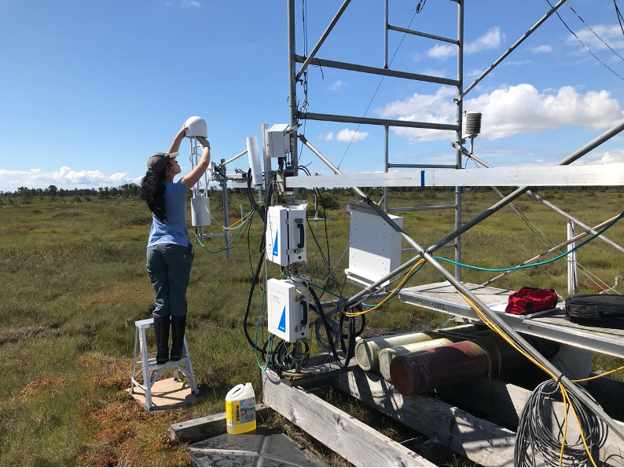
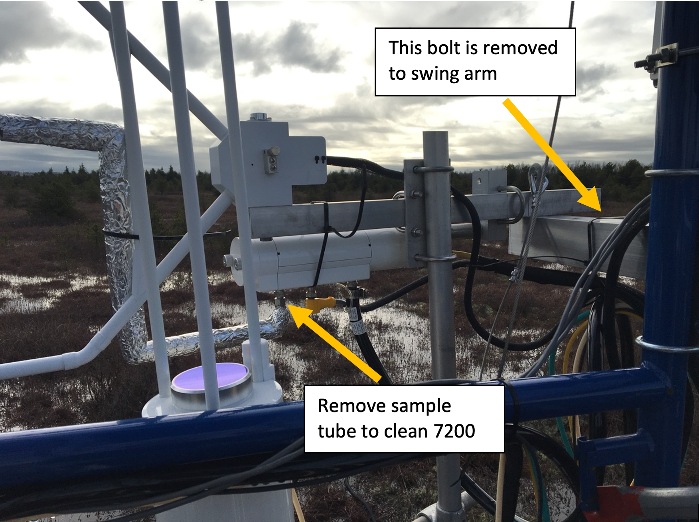

#  Monthly Maintenance & Calibration
{: .no_toc }

This page details the steps for maintaining and calibrating EC sensors at our flux sites.  Under normal operating conditions, maintenance trips should occur every 4-6 weeks for each site.  **At least two** lab members are required on each trip.  BB1 & BB2 should always be visited on the same trip.  DSM & RBM can also be visited in one trip to save fuel.

  

    Table of contents
  

  {: .text-delta }
1. TOC
{:toc}

---

# Pre-Departure Checklist

These are best done the afternoon/evening before a trip, although you many not be able to pack the truck until the morning of you can still gather supplies.  

Make sure to complete the following at least one day prior to leaving a site visit:

Task                                      | Notes
------------------------------------------|-------------------------------------------------------
Check Field Log(s)                        |[BB1 & BB2](https://docs.google.com/spreadsheets/d/1phokxNzc-gJkWIO1zGLUFsSeRgjsq0HE8QAfLlrlNyI/edit#gid=0) - *same sheet different tabs*, [DSM](https://docs.google.com/spreadsheets/d/1USa7IDpj0D79C8OfFDEoDFKIwjKt0LdVh5fMt04BgpI/edit#gid=0), [RBM](https://docs.google.com/spreadsheets/d/114pSwgLBPEeqIezTTIJ4a4Z3kaJhgRvSJZAls8mEOrI?authuser=thruhikerflash%40gmail.com&usp=drive_fs)
Book Micromet Truck                       |See Gcal **Add Link**
Check Fire Rating													|Burns Bog Permit holders should get fire danger rating updates from - Andy.Gogel@metrovancouver.org
Charge Field Laptop 				              |

Bring the following for each trip:

Items                                     | Notes
------------------------------------------|-------------------------------------------------------
Site Keys		    		                      |**Note** A list of all keys might be helpful?
Tools					  		                      |BB1 & BB2 have tools on site.  DSM & RMB do no.  Tools should be kept together in lab.  You will need: Wrenches, Screwdrivers (Robinson, Phillips, flat).
Field Laptop & Cables                     |Will also need Ethernet cable w/ USB converter dongle, RS 232 cable w/ serial bus converter dongle
Two empty USB sticks                      |
Cleaning wipes                            |Check relevant field logs to see if washer fluid is also needed
Manual WT tape measure                    |**Just BB Sites?**
Desiccant             		                |**BB1 & BB2**: 5 bags/site, **DSM**: 7 bags - 2 for logger box, 2 for power box, 2 for charger box, 1 for LI-7550 box, **RBM**: ...
LI 7700 Calibration Shield                |**Only for DSM & RMB** BB1 & BB2 have ones on site.
Battery & memory card for wildlife camera |**As needed or every trip?**
**First Aid & PPE**                       |First Aid kits: White metal one to stay in vehicle, red pouch carried to sites. Other PPE as needed - Hi-Vis vests, helmets (primarily for work around tower)
Chest Waders or Boots	  									|Boots are okay in summer, waders necessary in winter

Seasonally dependent items:

Items                                     | Notes
------------------------------------------|-------------------------------------------------------
Fire extinguisher													|Summer, stays in truck
Water																			|In summer bring a water sprayer & large jug of extra water
Wasp Spray   															|In summer as needed
Torch, lighter, deicing fluids for locks  |In winter as needed
Head lamp																	|In fall/winter

---

# Arrival Procedures

* Text Sara and Rick before leaving the lab, at each site, when leaving site, when return to UBC
* Burns Bog: check in and check out 
	* Call 604-520-6442 (leave msg if no answer)
* **In Summer** park away from the grass, spray the car tire with water.

### To DO
* Include site directions & link to field site navigation map/embed map.

---

# Cleaning the IRGAs

You must clean both the 7700 and 7200 before calibrating them!  Always do the 7700 first as the sensor mus be on for cleaning, followed by the 7200 as this requires a system restart.

**1**{: .label .label-red} Connect the laptop to the site system
* Use the ethernet cable and dongle to the top box on the outside of the scaffolding. 
* *Note*: remote connection via vinimet & mobile hotspot can also work in a pinch.
* **Add pic** - logger box at each each site for reference?

**2**{: .label .label-red} Retract the boom to access the flux sensors.  Loosen the two bolts securing the boom > pull quick release tab> slide boom in > *Be mindful of cables*
* **For BB1 & DSM**: place stepladder on plywood on the ground.  Make sure it’s solid.  

	

* **For BB2 & RBM**: loosen the wing nut > remove the fastening boot > lift up sensors to reduce force needed to pull out the bolt > rotate the arm to bring the sensors within reach from platform.  *Be careful* this can be quite difficult.

	

* Visually inspect the sensors for any obvious issues.

**3**{: .label .label-red} On the laptop open the program ‘LI-7700’.
* Click " Connect " (top toolbar) > Ethernet > Select Instrument > Connect
* Open 2nd data page and look at the single graph with signal strength

* **Add Screenshot**

**4**{: .label .label-red} Clean 7700 
* Wipe top and bottom windows with windshield cleaner (wet then dry cloth) until signal strength is high enough
	* **BB1** High 50’s
	* **BB2** Around 80
	* **DSM** Around 70
	* **RMB** ...

**5**{: .label .label-red} Disconnect from the 7700 and close the LI-7700 program.

**6**{: .label .label-red} Power down the flux system or have someone do it remotely.
* Inside the power box, flip the 3 switches as shown in the table below.
* Power is off when the red light is on.
* **Note**: Order does not matter when shutting down, but order is **very** important for proper start up
	* 1) LI-7200 pump, 2) LI-7700, 3) LI-7550
	* Allow 90 seconds between each when powering up.

<h2 align='center'>EC Sensor Power Channels</h2>

  Site | 	LI-7200 flow module (pump)	| LI-7700	| LI-7550
-------|--------------------------------|-----------|--------   
BB1    | 	12                          |	    7	|   2
BB2    | 	3                           |	    4	|   5
DMS    | 	3                           |	    4	|   5
RBM    | 	TBD                         |	    TBD	|   TBD

**7**{: .label .label-red} Open the 7200 sensor head
* Take the intake tube off by loosening nut with wrench, it tube can then just hang loosely from the tower, disconnected from the 7200
* Loosen knobs/screws on top of 7200 to release the top > take side part off
	* This can hang next to the instrument whilst cleaning.

	

	

**8**{: .label .label-red} Clean the 7200
* Wipe top and bottom windows with windshield cleaner (wet then dry cloth) 
* Clean intake filter with wipe.  May need to replace with a spare clean cap intake. If so:	
	* Remove the foil wrap
	* Use pliers to loosen up the metal ring and push it all the way to the tube
	* Remove the cap
	* Replace with a clean cap
	* Use pliers to put the metal ring back on the cap

**9**{: .label .label-red} Power system back up.  See table above.  **Note** allow 90 seconds between each step.
* Inside the Li-7550 box, the USB logging light should be flashing

**10**{: .label .label-red} On the laptop open the LI 7x00 program and connect the the 7500
* Check the signal strength.
	* About 100 for BB1
	* About 103 for BB2
	* About 102 for DMS
	* ... for RMB

---

# Calibration

These steps should **only** be completed after cleaning!

## Steps for 7200

See the [LICOR docs](https://www.licor.com/env/support/LI-7200RS/topics/calibration-procedure.html) for a more detailed overview of the 7200 calibration procedures: 

**1**{: .label .label-blue} On the laptop open the program ‘Li 77X0’
* Connect to instrument
* Click the LI-7200 icon and choose ‘calibration’

**2**{: .label .label-blue} Save the before calibration coefficients:
* Click “Config Files” tab >  “Save Configuration” > check all and “continue”.
* Place the file in this directory “C:\InstrumentCalibrations\LI-7200\SNxxxx”.  The serial numbers are:
	* 0816 for BB1
	* 0815 for BB2
	* 1029 for DSM
	* ... for RBM
* Naming template: yyyymmdd(**site visit date**)\_Configuration\_Before\_calibrations.l7x
	* Screenshots should also be taken before and after calibrating and saved in the same directory as the config files.

**3**{: .label .label-blue} Check the head serial number information in “LI-7200” > “Calibration” > “Coefficients”.  Make sure the head serial number on the sensor matches that in the software.

	

**4**{: .label .label-blue} Connect the calibration flow tube to the 7200 head
* At BB2, DSM & RMB - there is a special intake nozel that is always connected to the intake tube? At BB1 you need to do manually disconnect the intake tube first? **Double Check on next vists**

**5**{: .label .label-blue} Set CO2 zero
* Connect the flow meter to the N2 gas tank
	* Open main (bottom) valve - (on is left, off is right)
		* **Note**: PSI should be ~ 1200 (not necessary to the procedure, but good to note as it will decrease over time and indicated when we need a new gas tank)
* Open regulator slowly **Note**: reversed directions (on is right, off is left)
	* The flow rate should be around 18-20 L/min 
		* Lowest flow possible that will to push ambient air out
		* Turn on clockwise until you hear the flow

* Watch plot on the program – CO2 should drop to 0
	* Change scale if needed to check that the trace is flat/steady
	* On the calibration screen – green flags show that it’s steady
* Click “Zero CO2” > “OK”
* Click “Zero H2O > “OK”
* Check graph values continuously throughout the process to make sure values are correct
* Close N2 tank value
	* Close regulator first then main valve.

**6**{: .label .label-blue} Set CO2 span

* Move flow meter to CO2 tank and open the main valve
* Open regulator slowly **Note**: reversed directions (on is right, off is left)
	* The flow rate should be around 18-20 L/min 
		* Lowest flow possible that will to push ambient air out
		* Turn on clockwise until you hear the flow
* Enter span gas concentration (ppm).
	* **Confirm the exact value on the tank**
* Watch plot on the program
	* Change scale if needed to check that the trace is flat/steady
	* On the calibration screen – green flags show that it’s steady
* Click Span CO2” > “OK”
	* **Do Not** Click Span H2O
* Close CO2 tank value 
	* Close regulator first then main valve.
* Check how much gas we have left & take a picture

**7**{: .label .label-blue} Check and save calibration coefficients and take screenshots.

* You can find the calibration results in “LI-7200” > “Calibration” > “Manual” tab
	* Reference the table below for acceptable values
* Take a screenshot (alt + print screen) of the manual tab.
* Save the after calibration coefficients:
	* Click “Config Files” tab →  “Save Configuration” → check all and “continue”
	* Place the file in this directory “C:\InstrumentCalibrations\LI-7200\SNxxxx”.  The serial numbers are:
		* 0816 for BB1
		* 0815 for BB2
		* 1029 for DSM
		* ... for RBM
	* Naming template: yyyymmdd(**site visit date**)\_Configuration\_After\_calibrations.l7x
* Upload the screenshots on Micromet Google drive.
	* Micromet Lab/Projects/(**Flux Site**)/Flux-tower/Calibrations/LI-7200/SN0816

<h2 align='center'>Optimal Calibration Constant Values</h2>
Constant            |  Value       | Notes
--------------------|--------------|-----
CO2 Zero | 0.85 ~ 1.1   | Zero is primarily affected by temperature, and the state of the internal chemicals
CO2 Span | 0.97 ~ 1.03  | A value outside this range indicates is a warning sign for me that something is not correct with either the instrument (wrong head, bad sensor) or with the tank (not accurately calibrated).
H2) Zero | 0.9 ~ 1.2    | Set in lab (dobule check frequency?)
H2) Span | 0.9 ~ 1.1    | Set in lab (dobule check frequency?)

	

**8**{: .label .label-blue} Disconnect tubing from 7200 intake.  
* All the connections on the tubing that stays connected to the 'T' on the 7200 head should be wrench tight when finished with calibrations.

## Steps for 7700

### Ask - do we not save screenshots for 7700 calibration?

See the [LICOR docs](https://www.licor.com/env/support/LI-7700/topics/calibration.html) for a more detailed overview of the 7200 calibration procedures: 

**1**{: .label .label-green} Open LI-7700 Open Path Analyser program.
* Data page 1, 1 chart, CH4 (umol/mol).

**2**{: .label .label-green} Use calibration cylinder to cover the 7700.  **Note** At BB1 & BB2, it is in the equipment box, for DSM & RBM you must bring to the field.
* Make sure to remove 7700 head cap and washer tube first.
* Slide tube over the instrument, straps on top.
* Attach a small black tube into the LI-7700 cover, attach the black tube with the flow meter (same one as used for 7200) to the tube.
	* Will need to check union connections)

**3**{: .label .label-green} Set CH4 zero
* Connect the flow meter to the N2 gas tank
	* Open main (bottom) valve - (on is left, off is right)
		* **Note**: PSI should be ~ 1200 (not necessary to the procedure, but good to note as it will decrease over time and indicated when we need a new gas tank)
* Open regulator slowly **Note**: reversed directions (on is right, off is left)
	* The flow rate should be around 18-20 L/min 
		* Lowest flow possible that will to push ambient air out
		* Turn on clockwise until you hear the flow

* Watch plot on the program – CH4 should drop to 0 (or \~.13).
	* Change scale if needed to check that the trace is flat/steady
* Click “Zero CH4” > “Apply”
* Check graph values continuously throughout the process to make sure values are correct
* Close N2 tank value
	* Close regulator first then main valve.
* Check how much gas we have left & take a picture

**4**{: .label .label-green} Set CH4 span

* Move flow meter to CH4 tank and open the main valve
* Open regulator slowly **Note**: reversed directions (on is right, off is left)
	* The flow rate should be around 18-20 L/min 
		* Lowest flow possible that will to push ambient air out
		* Turn on clockwise until you hear the flow
* Enter span gas concentration (ppm).
	* **Confirm the exact value on the tank**
* Watch plot on the program
	* Change scale if needed to check that the trace is flat/steady
	* On the calibration screen – green flags show that it’s steady
* Click “Span CH4” > “Apply”
*	Exit the program.
* Close CH4 tank value 
	* Close regulator first then main valve.
* Check how much gas we have left & take a picture

**5**{: .label .label-blue} Remove the calibration shield
* Make sure to disconnect the tubing.
* Make sure to replace the 7700 head cap and washer tube first.

# Additional Tasks

If something is unusual, take a picture and report it to Rick

**1**{: .label .label-yellow} Check if the rain gauge is clogged.
* If so, unscrew the top and clean the funnel

**2**{: .label .label-yellow} Check if the SWC sensor is still positioned correctly 

**3**{: .label .label-yellow} Burns Bog: Check desiccant in water sensor desiccant cylinder.
* BB1 - inside logger box
* BB2 - outside logger box below

**4**{: .label .label-yellow} Refill the washer fluid if needed

**5**{: .label .label-yellow} **Burns Bog**: Clean up the rubber inside the box's lid, make sure nothing is stuck there so that water can’t go inside. 

**6**{: .label .label-yellow} Change wildlife camera’s memory card & battery 

**7**{: .label .label-yellow} Swap desiccant (Logger box, Powerbox, LI-7550 box, Charger box)

**8**{: .label .label-yellow} Swap USB sticks **Note**: will need to copy data off sticks when visiting DSM & RBM in same day as we only have two sticks?

**8**{: .label .label-yellow} Measure WTD

### Confirm?
**9**{: .label .label-yellow} Take pictures of veg plots at BB1/BB2? 

# Post Trip Procedures

**1**{: .label .label-purple} Text Sara and Rick when return to UBC

**2**{: .label .label-purple} Fill out km’s in log book in car on return to UBC

**3**{: .label .label-purple} Upload the files from the USB sticks to vinimet

**4**{: .label .label-purple} Copy calibration coefficient files from the laptop
* Burns Bog: (“C:\InstrumentCalibrations\LI-7200\SN0816(bb1) or SN0815(bb2)”) to Google Drive (Micromet Lab\Projects\2014-Burns Bog\Flux-tower (1)\Calibrations\LI-7200\SN0816 - for BB1)
### Need DSM & RMB

**5**{: .label .label-purple} Upload EC high-frequency data to vinimet 
* To connect to vinimet, use windows > run > \\vinimet.geog.ubc.ca  (worker > ponderosa) and empty USB sticks

**6**{: .label .label-purple} Charge the laptop

**7**{: .label .label-purple} Place desiccant in the oven

**8**{: .label .label-purple} Update field site logs
* [BB1 & BB2](https://docs.google.com/spreadsheets/d/1phokxNzc-gJkWIO1zGLUFsSeRgjsq0HE8QAfLlrlNyI/edit#gid=0) - *same sheet different tabs*
* [DSM](https://docs.google.com/spreadsheets/d/1USa7IDpj0D79C8OfFDEoDFKIwjKt0LdVh5fMt04BgpI/edit#gid=0)
* [RBM](https://docs.google.com/spreadsheets/d/114pSwgLBPEeqIezTTIJ4a4Z3kaJhgRvSJZAls8mEOrI?authuser=thruhikerflash%40gmail.com&usp=drive_fs)

**9**{: .label .label-purple} Upload pictures of gas tank/sensors/landscape to google drive (project/site/photos/yyyymmdd)

**10**{: .label .label-purple} Upload wildlife camera to google drive (project/site/photos/wildlife camera/yyyymmdd) and reformat the memory card

**11**{: .label .label-purple} Input the manually measured WTD to:
* [BB1](https://drive.google.com/drive/u/0/folders/1CxYCqgWcYUiZjOije5Yk_igRCdI4IJgF)
* [BB2](https://drive.google.com/drive/u/0/folders/157GZaM88Lz35QuXfYALlAXnDx9IydBGg)
